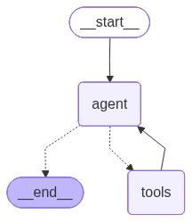
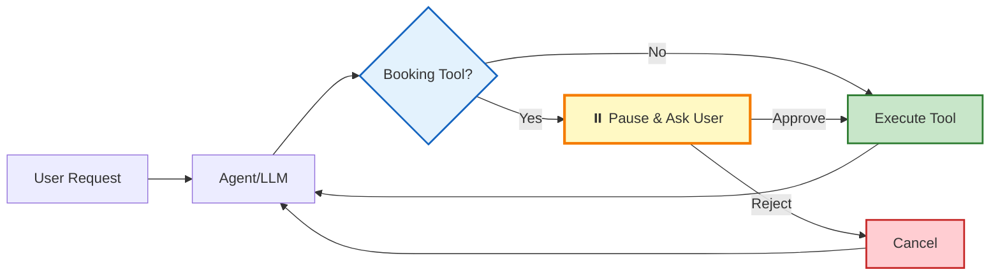

# 💈 Barbershop Booking Agent

AI-powered barbershop booking system with conversational interface, built on LangChain agents with FastAPI backend.

## Features

- **Conversational AI Agent**: Natural language booking interface powered by LangChain
- **Middleware-Integrated Tools**: Tools are part of middlewares with state management
- **Business Rules Enforcement**: Validates bookings (2-hour minimum notice, 24-hour cancellation policy)
- **Human-in-the-Loop**: Manual approval required for booking operations (create, cancel, modify)
- **Middleware Stack**: Customer lookup, service catalog, barber info, availability, booking operations
- **Cross-Cutting Concerns**: Business rules, conversation summary, usage tracking
- **REST API**: FastAPI backend for customers, barbers, services, and bookings
- **Async SQLAlchemy**: Database layer with Alembic migrations

### Agent Graph



## Example Conversations

**Successful Bookings:**
- "Book a haircut with Donny tomorrow at 7pm" (with email: james.w@email.com)
- "I need a beard trim next Tuesday at 3pm with Tony"
- "Schedule me for a premium haircut on Friday afternoon"

**Policy Violations:**
- ❌ "Book a haircut today at 8pm" (after 2pm cutoff)
- ❌ "I need a haircut in 1 hour" (insufficient notice)
- ❌ "Book me for January 15th, 2026" (too far in advance)

**Cancellations:**
- ✅ "Cancel my booking next week" (>24 hours notice)
- ✅ "I need to cancel my appointment on November 18th"
- ❌ "Cancel my appointment tomorrow" (<24 hours notice)

**Updates:**
- ✅ "Move my appointment to Friday at 3pm" (valid future date)
- ✅ "Reschedule my booking to next Tuesday"
- ❌ "Change my booking to today at 5pm" (same-day after cutoff)

## Documentation

Detailed documentation available in the `docs/` folder:

- **[ARCHITECTURE.md](docs/ARCHITECTURE.md)** - System architecture, tech stack, and design decisions
- **[AGENT_IMPLEMENTATIONS.md](docs/AGENT_IMPLEMENTATIONS.md)** - Agent implementation details and patterns
- **[MIDDLEWARE.md](docs/MIDDLEWARE.md)** - Middleware architecture with tool-integrated pattern

## Architecture

### Middleware-Integrated Tools

In this architecture, **tools are part of middlewares** rather than standalone functions. Each middleware:
- Defines its own tools
- Manages state related to those tools
- Uses `InjectedToolCallId` for proper tool call tracking
- Returns `Command` with state updates and `ToolMessage`

**Example Pattern**:
```python
class CustomerLookupMiddleware(AgentMiddleware):
    state_schema = CustomerLookupState

    def __init__(self):
        @tool(description="Look up customer by email, phone, or ID")
        async def lookup_customer(
            email: str,
            phone: str,
            customer_id: str,
            tool_call_id: Annotated[str, InjectedToolCallId],
        ) -> Command:
            # API call to fetch customer
            customer = await fetch_customer(email, phone, customer_id)

            # Update state and return
            return Command(
                update={
                    "customer_info": customer,
                    "messages": [ToolMessage(formatted, tool_call_id=tool_call_id)]
                }
            )

        self.tools = [lookup_customer]
```

### Human-in-the-Loop Flow

Booking operations require manual approval before execution:



**Operations requiring approval**:
   - `create_booking`,
   - `cancel_booking`,
   - `modify_booking`

**All other tools execute immediately** without approval.


## Development Setup

### Prerequisites

- Python 3.11+
- [uv](https://github.com/astral-sh/uv) (recommended) or pip
- OpenAI API key

### Installation

```bash
# Clone repository
git clone <repository-url>
cd barbershop

# Install dependencies with uv
uv sync --all-extras

# Or with pip
pip install -e ".[dev]"

# Configure environment
cp .env.example .env
# Edit .env and add your OPENAI_API_KEY
```

### Database Setup

```bash
# Initialize database schema
uv run poe db-init

# Seed with sample data
uv run poe db-seed

# List all data
uv run poe db-list

# List specific entities
uv run poe db-list-customers
uv run poe db-list-barbers
uv run poe db-list-services
uv run poe db-list-availability
uv run poe db-list-bookings

# Clear and reseed
uv run poe db-seed-clear
```

## Running the Application

### Development Servers

```bash
# Start FastAPI backend (port 8005)
uv run poe dev-api

# Start Chainlit UI (port 8006)
uv run poe dev-ui

# Run CLI agent directly
uv run poe dev-agent

# Start both API and UI together
uv run poe dev-all
```

### Database Management

The project uses Alembic for database migrations with async SQLAlchemy support.

```bash
# Create new migration (after modifying models)
uv run poe db-migrate "description of changes"
# Or directly: uv run alembic revision --autogenerate -m "message"

# Apply migrations
uv run poe db-upgrade
# Or directly: uv run alembic upgrade head

# Rollback one migration
uv run poe db-downgrade
# Or directly: uv run alembic downgrade -1

# Check current migration version
uv run poe db-current

# View migration history
uv run poe db-history

# Reset database (downgrade + upgrade)
uv run poe db-reset
```

**Configuration:**
- `alembic.ini` - Alembic configuration file
- `alembic/env.py` - Async migration environment setup
- `alembic/versions/` - Migration scripts directory

**Best Practices:**
- Always create a migration after modifying database models
- Review auto-generated migrations before applying them
- Test migrations on a development database first
- Never modify migration files after they've been applied to production

## Testing

```bash
# Run all tests
uv run poe test

# Unit tests only
uv run poe test-unit

# Integration tests only
uv run poe test-integration

# Generate coverage report
uv run poe test-cov
```

## Code Quality

```bash
# Linting
uv run poe lint           # Check for issues
uv run poe lint-fix       # Auto-fix issues

# Formatting
uv run poe format         # Format code with black
uv run poe format-check   # Check formatting

# Type checking
uv run poe type-check     # Run mypy

# Combined quality checks
uv run poe quality        # format + lint-fix + type-check
uv run poe check          # format-check + lint + type-check + test
uv run poe pre-commit     # quality + test (run before committing)
```

## Pre-commit Hooks

Install pre-commit hooks for automatic code quality checks:

```bash
# Install pre-commit
pip install pre-commit

# Install git hooks
pre-commit install

# Run manually on all files
pre-commit run --all-files
```

Pre-commit hooks include:
- Ruff linting and formatting
- Black formatting
- MyPy type checking
- Trailing whitespace removal
- YAML/JSON validation, etc...

## CI/CD

GitHub Actions workflows are configured in `.github/workflows/`:

### Continuous Integration (CI)
Runs on push and pull requests:
- **Lint & Format**: Ruff and Black checks
- **Type Check**: MyPy static analysis
- **Tests**: Unit and integration tests (Python 3.11 & 3.12)

**Trigger deployment**:
```bash
# Create and push version tag
git tag -a v1.0.0 -m "Release v1.0.0"
git push origin v1.0.0
```

## Project Structure

```
barbershop/
├── src/
│   ├── agent/              # LangChain agent implementation
│   │   ├── middleware/     # Middleware components
│   │   ├── tools/          # Agent tools (booking, customer, etc.)
│   │   └── llm/            # LLM registry
│   ├── api/                # FastAPI application
│   │   ├── models/         # Database models & schemas
│   │   └── routers/        # API endpoints
│   ├── core/               # Core configuration
├── tests/
│   ├── unit/               # Unit tests
│   └── integration/        # Integration tests
├── docs/                   # Documentation
├── alembic/                # Database migrations
├── run.py                  # CLI agent runner
└── pyproject.toml          # Project configuration
```

## Middleware Stack

The agent uses middleware that integrate tools and manage state:

### Tool-Integrated Middlewares

These middlewares provide both tools AND state management:

1. **CustomerLookupMiddleware** - Customer identification
   - Tool: `lookup_customer`
   - State: `customer_info` (name, email, phone, preferences)

2. **ServiceCatalogMiddleware** - Service selection
   - Tool: `browse_services`
   - State: `selected_service` (service details, price, duration)

3. **BarberInfoMiddleware** - Barber information
   - Tools: `list_barbers`, `get_barber_by_name`, `find_barbers_by_specialty`
   - State: `selected_barber` (barber details, specialties)

4. **AvailabilityMiddleware** - Time slot checking
   - Tool: `check_availability`
   - State: `availability_info` (available slots, date)

5. **BookingMiddleware** - Booking operations (HITL-protected)
   - Tools: `create_booking`, `modify_booking`, `cancel_booking`, `lookup_bookings`
   - State: `booking_info` (booking details, status)
   - **Note**: All operations require human approval

### Cross-Cutting Middlewares

These provide infrastructure concerns:

6. **BusinessRulesMiddleware** - Policy enforcement before tool execution
7. **ConversationSummaryMiddleware** - Memory management (trims history)
8. **UsageTrackingMiddleware** - Token consumption tracking

See [MIDDLEWARE.md](docs/MIDDLEWARE.md) for details.

## License

MIT License
