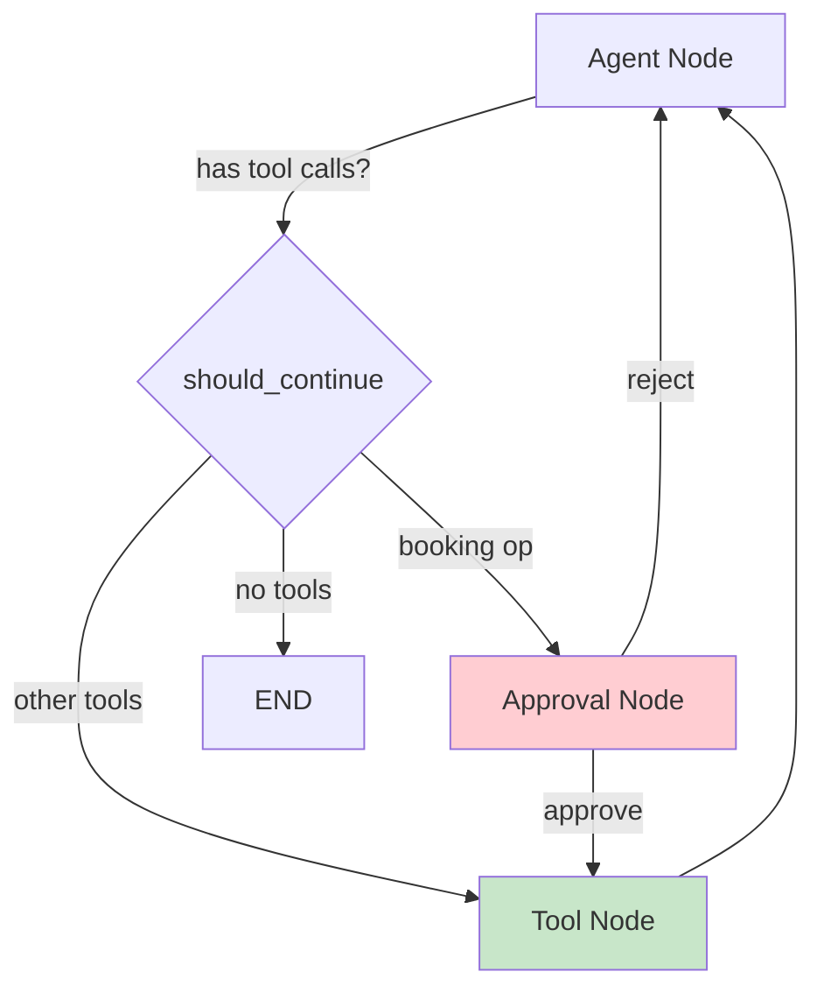

# Barbershop Booking Agent - Implementation Guide

This project provides **two distinct agent implementations** with different architectural approaches:

## 1. StateGraph Implementation (`graph.py`) - **Currently Active**

**File**: `src/agent/graph.py`
**Approach**: Explicit graph with custom HITL routing

### Architecture



**Components**:
- **Agent Node**: LLM with tools bound directly, system prompt injection
- **Tool Node**: LangGraph `ToolNode` for automatic tool execution
- **Approval Node**: Custom HITL with `interrupt()` for booking operations
- **Routing**: Conditional edges (`should_continue`, `route_after_approval`)

**HITL Implementation**:
- Routes booking ops (`create_booking`, `modify_booking`, `cancel_booking`) to approval node **before** execution
- Uses `interrupt({"action_requests": [...]})` format matching `run.py`
- Approved actions → route to tools; Rejected → inject cancellation message → return to agent

**Tools**: Explicitly collected from tool modules:
```python
tools = [
    *get_customer_tools(),
    *get_service_tools(),
    *get_barber_tools(),
    *get_availability_tools(),
    *get_booking_tools(),
]
llm_with_tools = llm.bind_tools(tools)
```

**State**: `BookingAgentState` (custom TypedDict)
**Checkpointer**: `MemorySaver()` for state persistence across interrupts

### Usage

```python
from src.agent.graph import create_booking_graph

# Create graph
graph = create_booking_graph()

# Run with checkpointing for HITL
config = {"configurable": {"thread_id": "session-123"}}
result = await graph.ainvoke({"messages": [...]}, config=config)

# Handle HITL interrupt
if "__interrupt__" in result:
    # Approve
    result = await graph.ainvoke(Command(resume={"decisions": [{"type": "approve"}]}), config=config)
```

**Visualize**:
```python
from IPython.display import Image, display
display(Image(graph.get_graph().draw_mermaid_png()))
```

---

## 2. Middleware Implementation (`agent.py`) - **Experimental**

**File**: `src/agent/agent.py`
**Approach**: `create_agent()` with middleware stack

### Architecture

**Middleware Stack**:
1. **AvailabilityMiddleware** - `check_availability` tool
2. **BarberInfoMiddleware** - `list_barbers`, `get_barber_by_name`, `find_barbers_by_specialty`
3. **BookingMiddleware** - `create_booking`, `modify_booking`, `cancel_booking`, `lookup_bookings`
4. **BusinessRulesMiddleware** - Policy enforcement (before_tool_call hook)
5. **ConversationSummaryMiddleware** - Message history trimming (max 20 messages)
6. **CustomerLookupMiddleware** - `lookup_customer` tool
7. **ServiceCatalogMiddleware** - `browse_services` tool
8. **PIIMiddleware** - Email/credit card masking
9. **UsageTrackingMiddleware** - Token consumption tracking
10. **HumanInTheLoopMiddleware** - Built-in HITL (different format than graph.py)

**HITL Implementation**:
- Uses built-in `HumanInTheLoopMiddleware(interrupt_on={...})`
- **Note**: May not match `run.py` interrupt handler format (uses different structure)

**Tools**: Empty list - tools automatically provided by middlewares:
```python
agent = create_agent(
    model=llm,
    tools=[],  # Middlewares provide tools
    middleware=[...],
)
```

### Usage

```python
from src.agent.agent import create_booking_agent

agent = create_booking_agent()
result = await agent.ainvoke({"messages": [...]})
```

---

## Key Differences

| Aspect | StateGraph (`graph.py`) ⭐ | Middleware (`agent.py`) |
|--------|--------------------------|------------------------|
| **Status** | **Production-ready** | Experimental |
| **HITL** | Custom approval node with routing | Built-in middleware (different format) |
| **Tools** | Explicit collection & binding | Auto-provided by middlewares |
| **Control** | Full graph control, visual debugging | Abstracted via middleware hooks |
| **Complexity** | More verbose, explicit | Simpler configuration |
| **State Management** | Manual state updates in nodes | Automatic via middleware |
| **Routing** | Conditional edges with custom logic | Automatic by create_agent |
| **Debugging** | Easy - see exact flow & nodes | Harder - abstracted flow |

## Running the Agent

Both implementations work with `run.py`:

```bash
# Use StateGraph (recommended)
python run.py --mode graph

# Use Middleware (experimental)
python run.py --mode agent
```

---

## Configuration

### LLM Provider Setup

Both implementations use the same LLM configuration from `src/core/config.py`:

**OpenAI (default)**:
```bash
LLM_PROVIDER=openai
OPENAI_API_KEY=sk-...
OPENAI_MODEL=gpt-4
```

**Azure OpenAI**:
```bash
LLM_PROVIDER=azure_openai
AZURE_OPENAI_API_KEY=your-key
AZURE_OPENAI_ENDPOINT=https://your-resource.openai.azure.com/
AZURE_OPENAI_API_VERSION=2025-03-01-preview
AZURE_OPENAI_DEPLOYMENT_NAME=gpt-4
OPENAI_MODEL=gpt-4
```

### Common Features

Both implementations share:
- ✅ Same tools from `src/agent/tools/`
- ✅ Same state schema (`BookingAgentState`)
- ✅ Same system prompt (`BOOKING_AGENT_SYSTEM_PROMPT`)
- ✅ LLM provider support (OpenAI, Azure OpenAI)
- ✅ Async execution
- ✅ Conversation history via messages
- ✅ Error handling
- ✅ `MemorySaver` checkpointer

**Difference**: HITL implementation and tool registration approach

---

## Implementation Details

### StateGraph HITL Flow

```python
# graph.py approval node
def approval_node(state):
    # Extract booking tool calls
    booking_tool_calls = [tc for tc in tool_calls if tc["name"] in BOOKING_OPERATIONS]

    # Build action_requests for run.py
    action_requests = [{
        "tool": tool_call["name"],
        "description": "...",
        "tool_call": tool_call,
        "tool_input": tool_call["args"]
    }]

    # Interrupt and wait for decision
    approval = interrupt({"action_requests": action_requests})

    # Handle decision
    if approval.get("decisions", [])[0].get("type") == "approve":
        return {}  # Continue to tools
    else:
        # Inject cancellation messages
        return {"messages": [ToolMessage("Action cancelled by user", ...)]}
```

**Routing**:
1. `should_continue()`: Routes booking ops to `"approval"`, others to `"tools"`
2. `approval_node()`: Interrupts, waits for decision
3. `route_after_approval()`: Routes to `"tools"` if approved, `"agent"` if rejected

### Middleware Tool Integration

```python
# agent.py - tools come from middlewares
class BookingMiddleware(AgentMiddleware):
    state_schema = BookingState

    def __init__(self):
        @tool
        async def create_booking(
            customer_id: str,
            tool_call_id: Annotated[str, InjectedToolCallId]
        ) -> Command:
            # Execute booking
            result = await api_call(...)

            # Return command with state update
            return Command(update={
                "booking_info": result,
                "messages": [ToolMessage(..., tool_call_id=tool_call_id)]
            })

        self.tools = [create_booking, ...]
```

**Pattern**: Tools use `InjectedToolCallId`, return `Command(update={...})`
