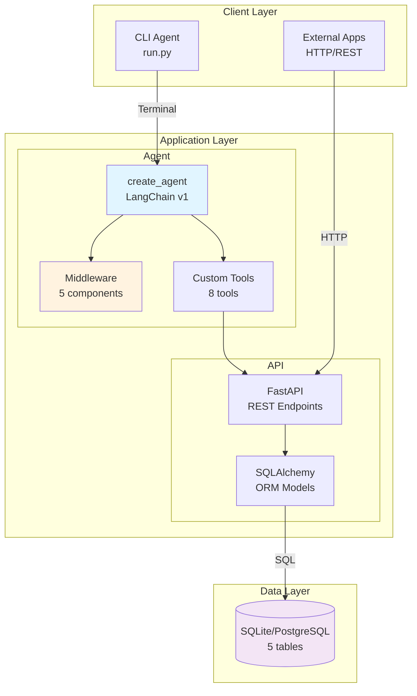
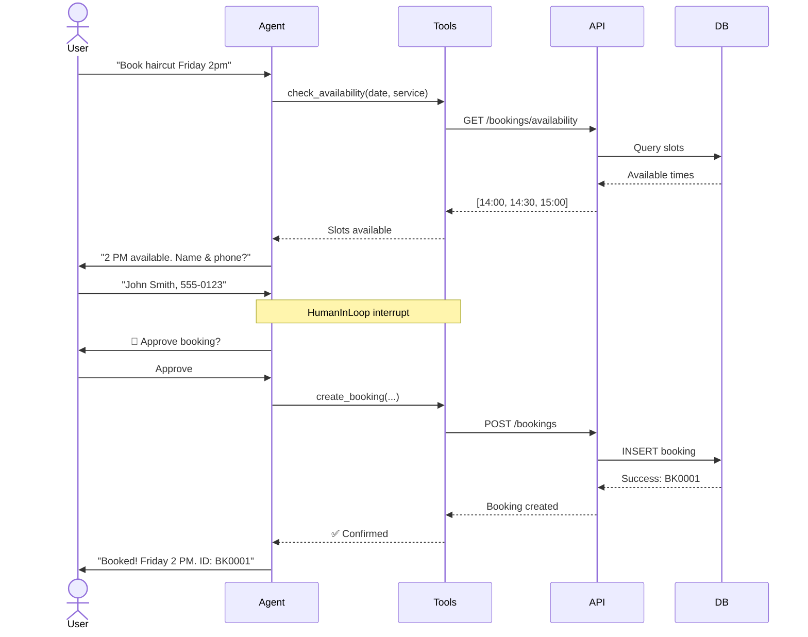
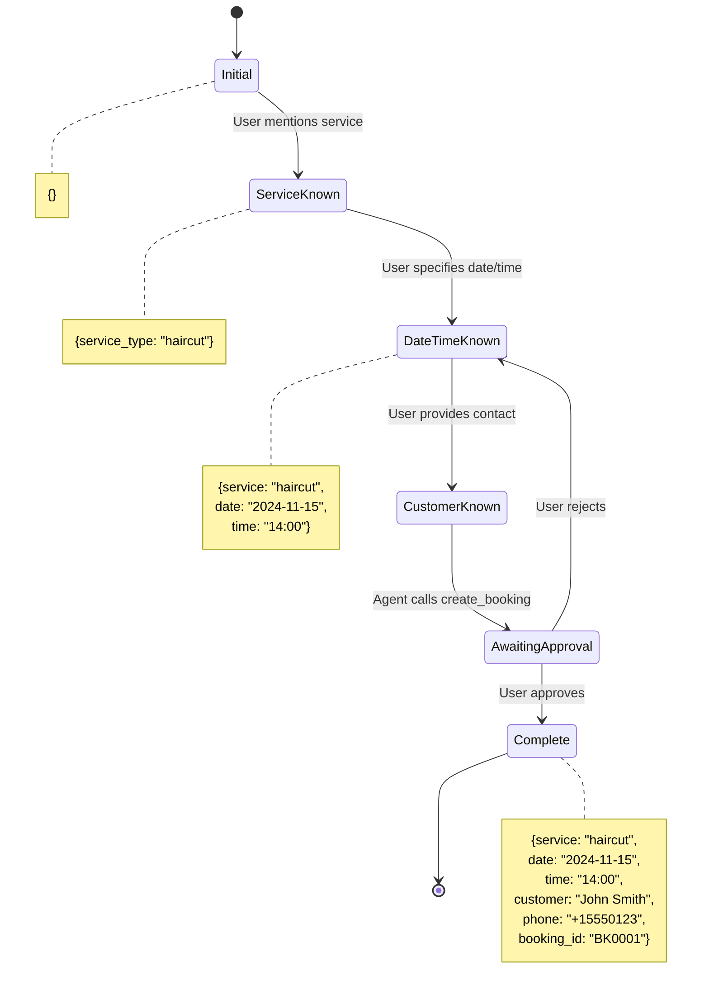
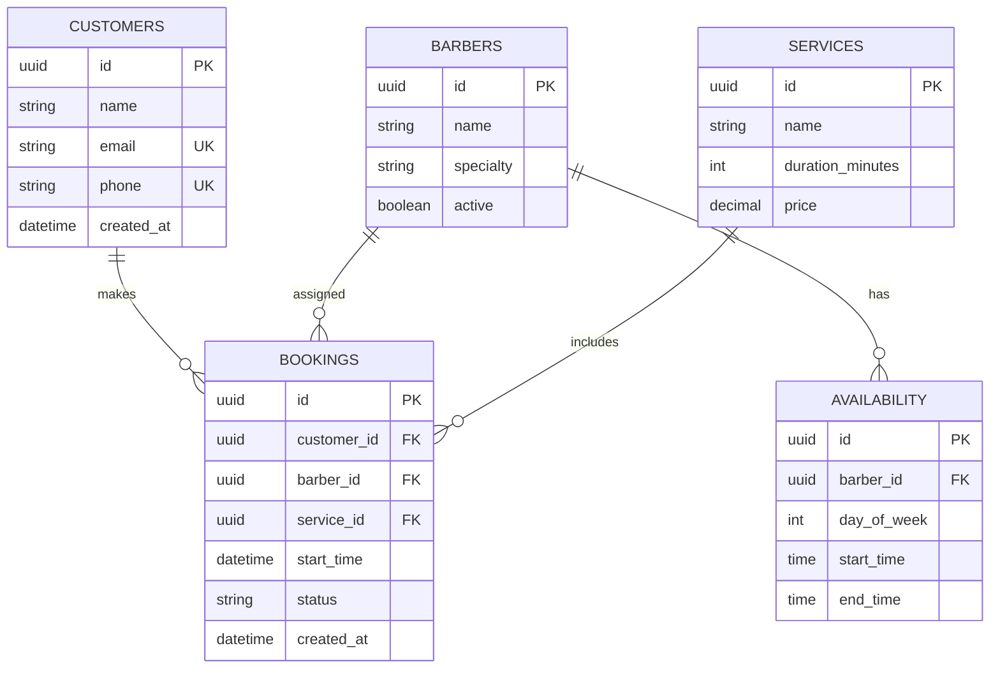
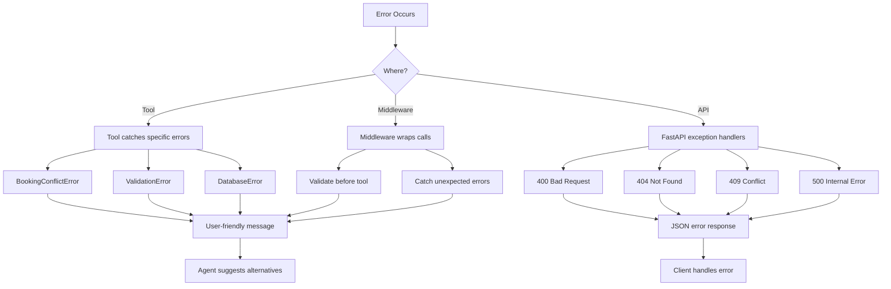

# Architecture Documentation

AI-powered barbershop booking system architecture using LangChain agents with FastAPI backend.

## System Overview



## Tech Stack

| Component | Technology | Purpose |
|-----------|-----------|---------|
| **Agent** | LangChain v1 `create_agent` | Conversational booking logic |
| **LLM** | GPT-4-mini | Natural language understanding |
| **Middleware** | LangChain middleware pattern | Context, PII, tracking, approval |
| **API** | FastAPI + Uvicorn | REST endpoints |
| **Database** | SQLAlchemy + SQLite/PostgreSQL | Data persistence |
| **Migrations** | Alembic | Schema management |

## Agent Architecture

### Why create_agent?

Using LangChain's `create_agent` instead of raw LangGraph:

```python
agent = create_agent(
    model=llm,
    tools=[...],                    # 8 custom tools
    system_prompt=prompt,           # Formatted with context
    middleware=[...],               # 5 middleware components
    checkpointer=MemorySaver()      # For HITL interrupts
)
```

**Tools** (see [AGENT_IMPLEMENTATIONS.md](AGENT_IMPLEMENTATIONS.md)):
- `check_availability` - Query available time slots
- `get_barbers` - List barbers and specialties
- `get_services` - List services and pricing
- `lookup_customer` - Find customer by email/phone
- `create_booking` - Create new booking
- `modify_booking` - Change existing booking
- `cancel_booking` - Cancel booking
- `check_policies` - Query business policies

**Middleware** (see [MIDDLEWARE.md](MIDDLEWARE.md)):
1. BusinessRules - Enforce booking policies before tool execution
2. ConversationSummary - Trim message history
3. PIIMiddleware (email) - Mask sensitive data
4. PIIMiddleware (credit_card) - Mask card numbers
5. UsageTracking - Track token usage
6. HumanInTheLoop - Approval for sensitive ops

## Data Flow

### Booking Creation Flow



### State Management



## API Architecture

### Endpoints

| Route | Methods | Purpose |
|-------|---------|---------|
| `/bookings` | GET, POST | List/create bookings |
| `/bookings/{id}` | GET, PUT, DELETE | Manage booking |
| `/bookings/availability` | GET | Check available slots |
| `/customers` | GET, POST | List/create customers |
| `/customers/{id}` | GET, PUT, DELETE | Manage customer |
| `/customers/lookup` | GET | Find by email/phone |
| `/barbers` | GET, POST | List/create barbers |
| `/barbers/{id}` | GET, PUT, DELETE | Manage barber |
| `/services` | GET, POST | List/create services |
| `/services/{id}` | GET, PUT, DELETE | Manage service |

### Database Schema



## Configuration

Uses Pydantic Settings for type-safe configuration:

```python
from src.core.config import get_settings

settings = get_settings()

# Type-checked access
api_port: int = settings.api_port
openai_key: str = settings.openai_api_key
db_url: str = settings.database_url
```

**Environment Variables**:
```bash
# LLM
OPENAI_API_KEY=sk-...

# API
API_HOST=0.0.0.0
API_PORT=8005

# Database
DATABASE_URL=sqlite:///./barbershop.db

# Agent
AGENT_MODEL=gpt-4-mini
AGENT_TEMPERATURE=0.7
```

## Error Handling



## Tool Design Pattern

All tools follow this structure:

```python
from langchain.tools import BaseTool
from pydantic import BaseModel, Field

class ToolInput(BaseModel):
    """Input schema with validation."""
    param: str = Field(description="Parameter description")

class CustomTool(BaseTool):
    """Tool description for agent."""

    name: str = "tool_name"
    description: str = "When to use this tool"
    args_schema: type[BaseModel] = ToolInput

    async def _arun(self, **kwargs) -> str:
        """Execute tool logic."""
        try:
            # 1. Validate inputs
            # 2. Call API
            # 3. Format response
            return "Success message"
        except SpecificError as e:
            return f"Error: {user_friendly_message}"
```

**Principles**:
- Return strings (agent-readable)
- Include success and error paths
- Validate inputs with Pydantic
- Single responsibility
- Detailed descriptions for agent

## Development Workflow

```bash
# Start API server
uv run poe dev-api

# Run agent CLI
uv run poe dev-agent

# Run tests
uv run poe test

# Code quality
uv run poe lint
uv run poe format
uv run poe type-check
```

See [README.md](../README.md) for full development setup.
