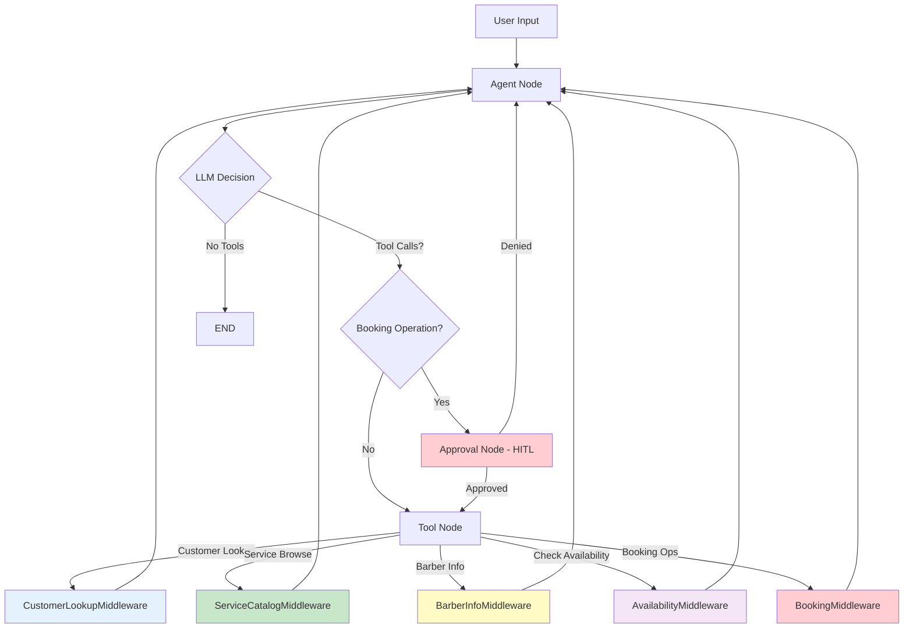
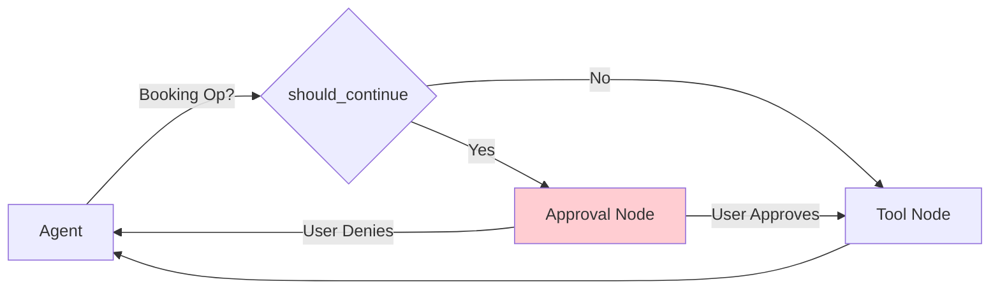

# Middleware Architecture

Middleware components provide cross-cutting concerns and tool execution for the booking agent using LangChain v1's middleware pattern.

## Overview

**Tools are part of middlewares** rather than standalone components. Each middleware:
- Defines its own tools
- Manages state related to those tools
- Wraps model calls to inject context
- Returns `Command` with state updates



## Middleware Stack

### Tool-Integrated Middlewares

| Middleware | Tools | State Managed | Purpose |
|------------|-------|---------------|---------|
| **CustomerLookupMiddleware** | `lookup_customer` | `customer_info` | Customer identification |
| **ServiceCatalogMiddleware** | `browse_services` | `selected_service` | Service catalog |
| **BarberInfoMiddleware** | `list_barbers`<br>`get_barber_by_name`<br>`find_barbers_by_specialty` | `selected_barber` | Barber information |
| **AvailabilityMiddleware** | `check_availability` | `availability_info` | Time slot checking |
| **BookingMiddleware** | `create_booking`<br>`modify_booking`<br>`cancel_booking`<br>`lookup_bookings` | `booking_info` | Booking operations<br>**(HITL-protected)** |

### Cross-Cutting Middlewares

| Middleware | Purpose | Hook |
|------------|---------|------|
| **BusinessRulesMiddleware** | Policy enforcement | `before_tool_call` |
| **ConversationSummaryMiddleware** | Memory management | `before_model` |
| **UsageTrackingMiddleware** | Token tracking | `after_model` |

```python
class CustomerLookupState(AgentState):
    customer_info: Annotated[NotRequired[CustomerInfo], OmitFromInput]
```

## Tool Details

### CustomerLookupMiddleware
- **Tools**: `lookup_customer`
- **State**: `customer_info` (customer_id, name, email, phone, preferences)
- **Purpose**: Customer identification by email, phone, or ID

### ServiceCatalogMiddleware
- **Tools**: `browse_services`
- **State**: `selected_service` (service_id, name, description, price, duration)
- **Purpose**: Service catalog browsing

### BarberInfoMiddleware
- **Tools**: `list_barbers`, `get_barber_by_name`, `find_barbers_by_specialty`
- **State**: `selected_barber` (barber_id, name, email, phone, specialties, is_active)
- **Purpose**: Barber information and specialty search
- **Note**: Use `AvailabilityMiddleware.check_availability` for time slots

### AvailabilityMiddleware
- **Tools**: `check_availability`
- **State**: `availability_info` (date, available_slots, total_available)
- **Purpose**: Check appointment time slot availability

### BookingMiddleware (HITL-Protected)
- **Tools**: `create_booking`, `modify_booking`, `cancel_booking`, `lookup_bookings`
- **State**: `booking_info` (booking_id, customer_id, service_id, barber_id, booking_date, booking_time, status, notes)
- **Purpose**: Booking operations with human approval required

---

## Cross-Cutting Middlewares

### BusinessRulesMiddleware
- **Location**: `src/agent/middleware/business_rules.py`
- **Hook**: `before_tool_call`
- **Validated Tools**: `create_booking`, `cancel_booking`, `modify_booking`
- **Policies**: 2hr same-day notice, 24hr cancellation, 14-day max advance, business hours validation

### ConversationSummaryMiddleware
- **Hook**: `before_model`
- **Purpose**: Trims message history when exceeding token limits

### UsageTrackingMiddleware
- **Hook**: `after_model`
- **Purpose**: Tracks LLM token usage and costs

---

## HITL (Human-in-the-Loop) Approval

Booking operations require human approval before execution via graph-level routing:



**Implementation**: `src/agent/graph.py`
- `approval_node()`: Uses `interrupt()` to pause execution
- `should_continue()`: Routes booking ops to approval
- `route_after_approval()`: Handles approve/reject decisions

**Protected Operations**: `create_booking`, `modify_booking`, `cancel_booking`

---

## Key Patterns

### InjectedToolCallId
Tools use `Annotated[str, InjectedToolCallId]` - LangGraph injects automatically:
```python
@tool
async def my_tool(param: str, tool_call_id: Annotated[str, InjectedToolCallId]) -> Command:
    return Command(update={"messages": [ToolMessage(content="...", tool_call_id=tool_call_id)]})
```

### Command Return Pattern
Tools return `Command(update={...})` with state and messages:
```python
return Command(
    update={
        "customer_info": customer_data,
        "messages": [ToolMessage(content="Found customer", tool_call_id=tool_call_id)]
    }
)
```

### State Schema Extension
Middlewares extend `AgentState` with `TypedDict` fields:
```python
class MyState(AgentState):
    my_info: Annotated[NotRequired[MyInfo], OmitFromInput]
```

---

## Adding Custom Middleware

```python
from langchain.agents.middleware import AgentMiddleware, AgentState
from langchain.tools import InjectedToolCallId
from langchain_core.tools import tool
from langgraph.types import Command

class MyMiddleware(AgentMiddleware):
    state_schema = MyState  # Extend AgentState

    def __init__(self):
        @tool(description="My tool")
        async def my_tool(param: str, tool_call_id: Annotated[str, InjectedToolCallId]) -> Command:
            result = process(param)
            return Command(update={"my_info": result, "messages": [ToolMessage(...)]})

        self.tools = [my_tool]

# Add to agent (src/agent/agent.py)
middlewares = [
    # ... existing middlewares
    MyMiddleware(),
]
```

---

## Testing

```python
# Test tool execution
result = await agent.ainvoke({
    "messages": [{"role": "user", "content": "lookup john@example.com"}]
})
assert "customer_info" in result

# Test HITL approval
config = {"configurable": {"thread_id": "test-123"}}
result = await agent.ainvoke({"messages": [...]}, config=config)
if "__interrupt__" in result:
    result = await agent.ainvoke(Command(resume={"decisions": [{"type": "approve"}]}), config=config)
```
